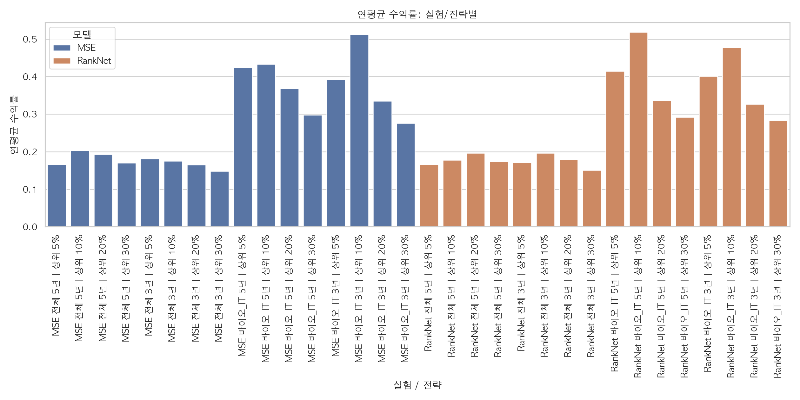
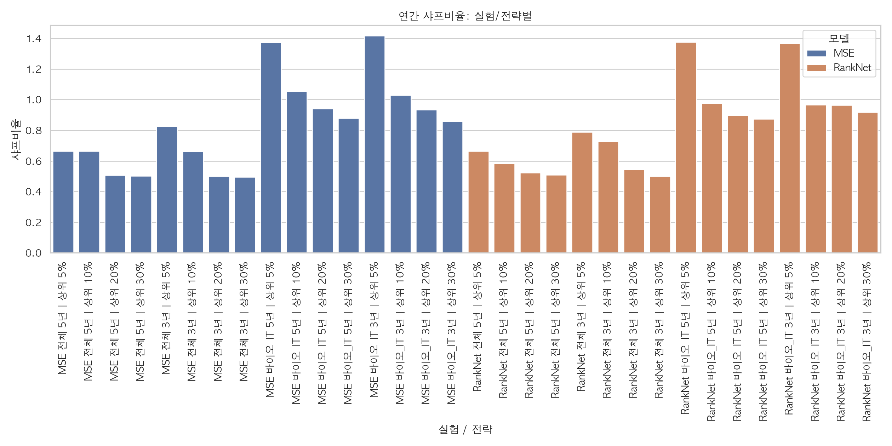
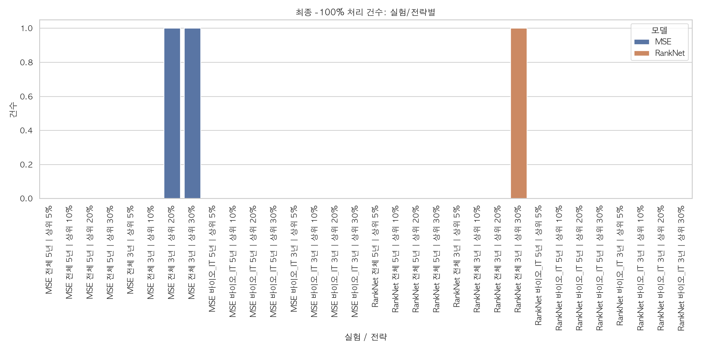
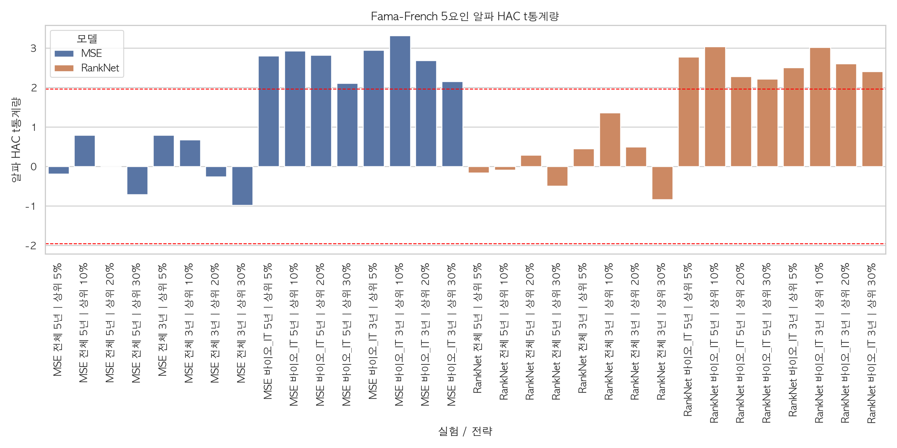
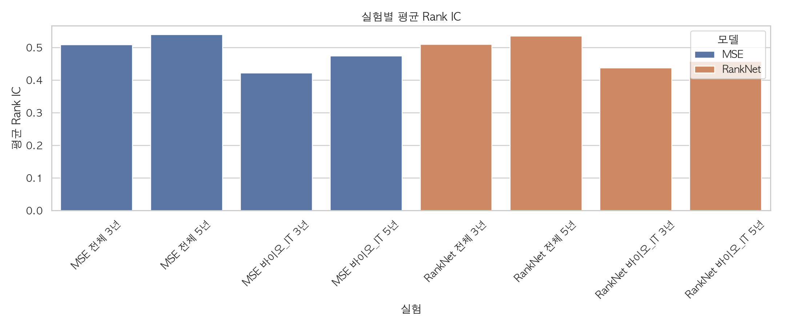
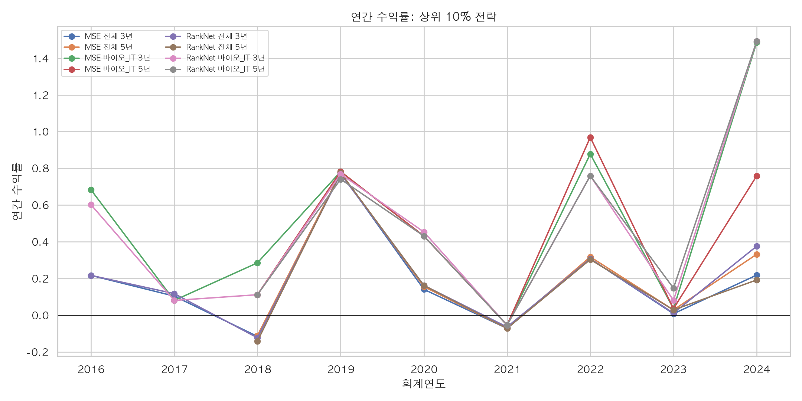
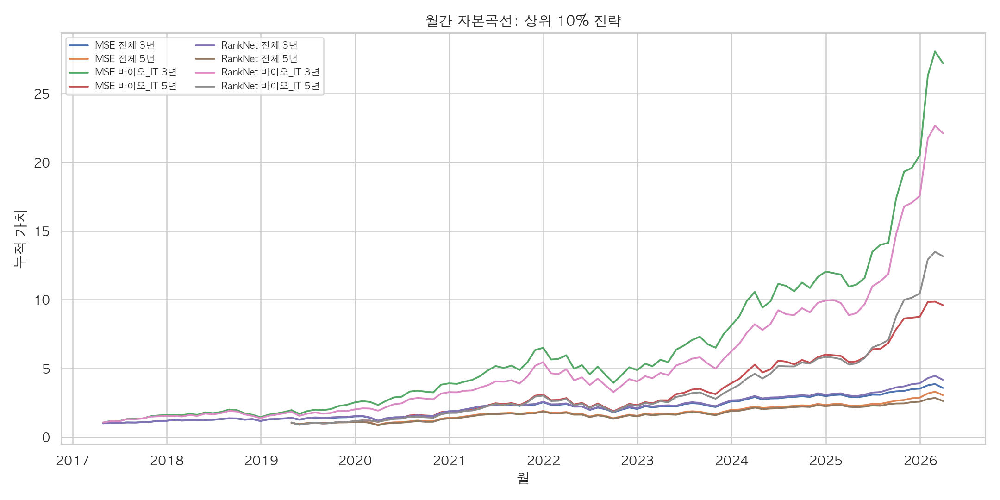

# 캡스톤 S&P500 실험 정량 보고서

- 생성 시각: 2026-06-02T19:02:33
- 실험 조합: S&P500 / {MSE, RankNet} / {전체, 바이오_IT} / {5년, 3년 롤링 윈도우}
- 전략: 예측 괴리율 기준 상위 5%, 10%, 20%, 30% 포트폴리오
- 예측 대상: 섹터 중립 ln(PBR) 괴리율
- 유의성 검정: 연간 수익률 단일표본 t-test, 월간 수익률 단일표본 t-test, 부트스트랩 평균수익률 분포, Fama-French 5요인 알파 Newey-West/HAC t-통계량, Rank IC t-test

## 데이터 품질 및 처리 기준

| 항목 | 값 |
| --- | --- |
| 전체 후보 티커 수 | 770 |
| S&P500 연도별 멤버십 행 수 | 7548 |
| 월별 가격 기간 수 | 185 |
| 월별 가격 티커 수 | 638 |
| 가격 누락 티커 수 | 132 |
| 수동 보완 가격 숫자 행 수 | 0 |
| 재무 데이터 행 수 | 39123 |
| 재무 데이터 티커 수 | 768 |
| 재무 데이터 실패 티커 수 | 2 |
| 모델 입력 가능 feature 행 수 | 4146 |
| 모델 입력 가능 티커 수 | 473 |
| feature 시작연도 | 2013 |
| feature 종료연도 | 2025 |

### 결측치 및 이상치 처리

- SEC companyfacts 재무 데이터에서 R&D/SG&A가 없는 경우, 기존 CARL 파이프라인 및 PDF의 정책과 맞춰 무형투자 계산에서 0으로 처리했습니다.
- 모델 필수 변수(`m1`, `m2`, `m3`, `y`, `Close`)가 없는 행은 학습/예측 전에 제거했습니다.
- 로그 변환 전 PBR은 [0.01, 100]으로 제한했고, `m1`, `m2`는 [-5, 5], `m3`는 [0, 10] 범위로 제한했습니다.
- look-ahead bias를 줄이기 위해 valuation 기준일은 `period_end + 3개월`과 실제 공시일 중 더 늦은 날짜의 월말로 잡았습니다.
- 백테스트 매수가는 리밸런싱일 기준 45일 이내에 존재해야 합니다.
- 보유기간이 완전히 끝난 연도만 평가했습니다. 목표 매도일이 현재 가격 데이터 범위를 넘어서는 마지막 미완료 연도는 제외했습니다.
- 목표 매도일이 가격 데이터 범위 안에 있는데 개별 종목 매도가격이 없으면 상폐/거래중단으로 보고 해당 종목 수익률을 -100%로 처리했습니다.
- 리밸런싱 전 12개월 중 가격이 5달러 이하인 비율이 80% 이상이면 가격 필터를 통과하지 못하게 했습니다.
- 수동 보완 엑셀 확인 결과 숫자로 채워진 가격 행은 0건이어서 추가 병합하지 않았습니다.

## 시각화

## 실험 실행 로그

| 실험명 | 산출물 경로 | 모델 | 섹터 범위 | 롤링 윈도우(년) | 예측 행 수 | 백테스트 행 수 | 생성 시각 |
| --- | --- | --- | --- | --- | --- | --- | --- |
| MSE 전체 5년 | /Users/henrykil/Library/Mobile Documents/com~apple~CloudDocs/1. 대학수업/4학년 1학기/캡스톤 디자인(벤경)/캡스톤 프로젝트/캡스톤_실험/experiments/sp500_mse_all_w5 | MSE | 전체 | 5 | 2816 | 28 | 2026-06-02T18:58:10 |
| MSE 전체 3년 | /Users/henrykil/Library/Mobile Documents/com~apple~CloudDocs/1. 대학수업/4학년 1학기/캡스톤 디자인(벤경)/캡스톤 프로젝트/캡스톤_실험/experiments/sp500_mse_all_w3 | MSE | 전체 | 3 | 3393 | 36 | 2026-06-02T18:58:10 |
| MSE 바이오_IT 5년 | /Users/henrykil/Library/Mobile Documents/com~apple~CloudDocs/1. 대학수업/4학년 1학기/캡스톤 디자인(벤경)/캡스톤 프로젝트/캡스톤_실험/experiments/sp500_mse_bio_it_w5 | MSE | 바이오_IT | 5 | 497 | 28 | 2026-06-02T18:58:10 |
| MSE 바이오_IT 3년 | /Users/henrykil/Library/Mobile Documents/com~apple~CloudDocs/1. 대학수업/4학년 1학기/캡스톤 디자인(벤경)/캡스톤 프로젝트/캡스톤_실험/experiments/sp500_mse_bio_it_w3 | MSE | 바이오_IT | 3 | 583 | 36 | 2026-06-02T18:58:10 |
| RankNet 전체 5년 | /Users/henrykil/Library/Mobile Documents/com~apple~CloudDocs/1. 대학수업/4학년 1학기/캡스톤 디자인(벤경)/캡스톤 프로젝트/캡스톤_실험/experiments/sp500_ranknet_all_w5 | RankNet | 전체 | 5 | 2816 | 28 | 2026-06-02T18:58:10 |
| RankNet 전체 3년 | /Users/henrykil/Library/Mobile Documents/com~apple~CloudDocs/1. 대학수업/4학년 1학기/캡스톤 디자인(벤경)/캡스톤 프로젝트/캡스톤_실험/experiments/sp500_ranknet_all_w3 | RankNet | 전체 | 3 | 3393 | 36 | 2026-06-02T18:58:10 |
| RankNet 바이오_IT 5년 | /Users/henrykil/Library/Mobile Documents/com~apple~CloudDocs/1. 대학수업/4학년 1학기/캡스톤 디자인(벤경)/캡스톤 프로젝트/캡스톤_실험/experiments/sp500_ranknet_bio_it_w5 | RankNet | 바이오_IT | 5 | 497 | 28 | 2026-06-02T18:58:10 |
| RankNet 바이오_IT 3년 | /Users/henrykil/Library/Mobile Documents/com~apple~CloudDocs/1. 대학수업/4학년 1학기/캡스톤 디자인(벤경)/캡스톤 프로젝트/캡스톤_실험/experiments/sp500_ranknet_bio_it_w3 | RankNet | 바이오_IT | 3 | 583 | 36 | 2026-06-02T18:58:10 |

## 백테스트 요약: 전체 정량 지표

| 전략 | 평가 연수 | 평균 연수익률 | 누적수익률 | CAGR | 최대낙폭(MDD) | 샤프 비율 | 평균 선정 종목 수 | 평균 가격 확인 종목 수 | -100% 처리 건수 | 가격 누락 건수 | 실험 | 유니버스 | 모델 | 섹터 범위 | 롤링 윈도우(년) |
| --- | --- | --- | --- | --- | --- | --- | --- | --- | --- | --- | --- | --- | --- | --- | --- |
| 상위 5% | 7 | 0.166114 | 1.58921 | 0.145576 | -0.0547946 | 0.66293 | 16.8571 | 16.8571 | 0 | 0 | MSE 전체 5년 | S&P500 | MSE | 전체 | 5 |
| 상위 10% | 7 | 0.203526 | 2.05088 | 0.172745 | -0.0722229 | 0.663201 | 34.4286 | 34.4286 | 0 | 0 | MSE 전체 5년 | S&P500 | MSE | 전체 | 5 |
| 상위 20% | 7 | 0.193015 | 1.64387 | 0.149 | -0.0539991 | 0.506838 | 69.2857 | 69.2857 | 0 | 0 | MSE 전체 5년 | S&P500 | MSE | 전체 | 5 |
| 상위 30% | 7 | 0.170574 | 1.40312 | 0.133435 | -0.0443022 | 0.501091 | 103.857 | 103.857 | 0 | 0 | MSE 전체 5년 | S&P500 | MSE | 전체 | 5 |
| 상위 5% | 9 | 0.18106 | 2.93707 | 0.164475 | -0.069495 | 0.825202 | 16.2222 | 16.2222 | 0 | 0 | MSE 전체 3년 | S&P500 | MSE | 전체 | 3 |
| 상위 10% | 9 | 0.175641 | 2.5769 | 0.152128 | -0.116006 | 0.662595 | 33.1111 | 33.1111 | 0 | 0 | MSE 전체 3년 | S&P500 | MSE | 전체 | 3 |
| 상위 20% | 9 | 0.164915 | 2.02357 | 0.130814 | -0.196565 | 0.498854 | 66.5556 | 66.5556 | 1 | 0 | MSE 전체 3년 | S&P500 | MSE | 전체 | 3 |
| 상위 30% | 9 | 0.148016 | 1.7405 | 0.11853 | -0.211594 | 0.495014 | 99.8889 | 99.8889 | 1 | 0 | MSE 전체 3년 | S&P500 | MSE | 전체 | 3 |
| 상위 5% | 7 | 0.42398 | 9.22038 | 0.393829 | -0.015323 | 1.37381 | 2.57143 | 2.57143 | 0 | 0 | MSE 바이오_IT 5년 | S&P500 | MSE | 바이오_IT | 5 |
| 상위 10% | 7 | 0.433223 | 8.60419 | 0.381502 | -0.0545058 | 1.05355 | 5.57143 | 5.57143 | 0 | 0 | MSE 바이오_IT 5년 | S&P500 | MSE | 바이오_IT | 5 |
| 상위 20% | 7 | 0.367777 | 5.98018 | 0.319935 | -0.06142 | 0.942222 | 11.5714 | 11.5714 | 0 | 0 | MSE 바이오_IT 5년 | S&P500 | MSE | 바이오_IT | 5 |
| 상위 30% | 7 | 0.297757 | 4.06024 | 0.260654 | -0.0356125 | 0.879766 | 17.5714 | 17.5714 | 0 | 0 | MSE 바이오_IT 5년 | S&P500 | MSE | 바이오_IT | 5 |
| 상위 5% | 9 | 0.392113 | 15.6746 | 0.367048 | -0.015323 | 1.41591 | 2.44444 | 2.44444 | 0 | 0 | MSE 바이오_IT 3년 | S&P500 | MSE | 바이오_IT | 3 |
| 상위 10% | 9 | 0.511783 | 26.2183 | 0.44354 | -0.0545058 | 1.02894 | 5.22222 | 5.22222 | 0 | 0 | MSE 바이오_IT 3년 | S&P500 | MSE | 바이오_IT | 3 |
| 상위 20% | 9 | 0.335 | 9.12922 | 0.293393 | -0.06142 | 0.935028 | 10.8889 | 10.8889 | 0 | 0 | MSE 바이오_IT 3년 | S&P500 | MSE | 바이오_IT | 3 |
| 상위 30% | 9 | 0.276101 | 6.02664 | 0.24189 | -0.0356581 | 0.858297 | 16.4444 | 16.4444 | 0 | 0 | MSE 바이오_IT 3년 | S&P500 | MSE | 바이오_IT | 3 |
| 상위 5% | 7 | 0.166281 | 1.59247 | 0.145782 | -0.0547946 | 0.664084 | 16.8571 | 16.8571 | 0 | 0 | RankNet 전체 5년 | S&P500 | RankNet | 전체 | 5 |
| 상위 10% | 7 | 0.178176 | 1.62465 | 0.147803 | -0.0722229 | 0.582915 | 34.4286 | 34.4286 | 0 | 0 | RankNet 전체 5년 | S&P500 | RankNet | 전체 | 5 |
| 상위 20% | 7 | 0.196038 | 1.71831 | 0.153567 | -0.0464981 | 0.523763 | 69.2857 | 69.2857 | 0 | 0 | RankNet 전체 5년 | S&P500 | RankNet | 전체 | 5 |
| 상위 30% | 7 | 0.173626 | 1.45228 | 0.136718 | -0.045816 | 0.51002 | 103.857 | 103.857 | 0 | 0 | RankNet 전체 5년 | S&P500 | RankNet | 전체 | 5 |
| 상위 5% | 9 | 0.171338 | 2.66428 | 0.155222 | -0.069495 | 0.78862 | 16.2222 | 16.2222 | 0 | 0 | RankNet 전체 3년 | S&P500 | RankNet | 전체 | 3 |
| 상위 10% | 9 | 0.196704 | 3.16318 | 0.171723 | -0.123543 | 0.72711 | 33.1111 | 33.1111 | 0 | 0 | RankNet 전체 3년 | S&P500 | RankNet | 전체 | 3 |
| 상위 20% | 9 | 0.17847 | 2.38025 | 0.144912 | -0.187528 | 0.543192 | 66.5556 | 66.5556 | 0 | 0 | RankNet 전체 3년 | S&P500 | RankNet | 전체 | 3 |
| 상위 30% | 9 | 0.150545 | 1.78971 | 0.120745 | -0.205302 | 0.49977 | 99.8889 | 99.8889 | 1 | 0 | RankNet 전체 3년 | S&P500 | RankNet | 전체 | 3 |
| 상위 5% | 7 | 0.414825 | 8.8224 | 0.385943 | -0.015323 | 1.37443 | 2.57143 | 2.57143 | 0 | 0 | RankNet 바이오_IT 5년 | S&P500 | RankNet | 바이오_IT | 5 |
| 상위 10% | 7 | 0.518105 | 12.1601 | 0.445088 | -0.0545058 | 0.974688 | 5.57143 | 5.57143 | 0 | 0 | RankNet 바이오_IT 5년 | S&P500 | RankNet | 바이오_IT | 5 |
| 상위 20% | 7 | 0.33626 | 5.00088 | 0.291735 | -0.0810477 | 0.897894 | 11.5714 | 11.5714 | 0 | 0 | RankNet 바이오_IT 5년 | S&P500 | RankNet | 바이오_IT | 5 |
| 상위 30% | 7 | 0.292012 | 3.92433 | 0.25576 | -0.0624145 | 0.875079 | 17.5714 | 17.5714 | 0 | 0 | RankNet 바이오_IT 5년 | S&P500 | RankNet | 바이오_IT | 5 |
| 상위 5% | 9 | 0.401327 | 16.4343 | 0.373833 | -0.015323 | 1.3659 | 2.44444 | 2.44444 | 0 | 0 | RankNet 바이오_IT 3년 | S&P500 | RankNet | 바이오_IT | 3 |
| 상위 10% | 9 | 0.476853 | 21.1189 | 0.410647 | -0.0545058 | 0.967596 | 5.22222 | 5.22222 | 0 | 0 | RankNet 바이오_IT 3년 | S&P500 | RankNet | 바이오_IT | 3 |
| 상위 20% | 9 | 0.326537 | 8.89753 | 0.290072 | -0.0405827 | 0.9642 | 10.8889 | 10.8889 | 0 | 0 | RankNet 바이오_IT 3년 | S&P500 | RankNet | 바이오_IT | 3 |
| 상위 30% | 9 | 0.283839 | 6.58422 | 0.252472 | -0.0371541 | 0.918362 | 16.4444 | 16.4444 | 0 | 0 | RankNet 바이오_IT 3년 | S&P500 | RankNet | 바이오_IT | 3 |

## 연간 수익률 유의성 검정

| 실험 | 유니버스 | 모델 | 섹터 범위 | 롤링 윈도우(년) | 전략 | 연간 표본 수 | 평균 연수익률 | 연수익률 표준편차 | t-통계량(평균=0) | p값(양측) | 95% 신뢰구간 하한 | 95% 신뢰구간 상한 | 부트스트랩 반복 수 | 부트스트랩 평균 5% | 부트스트랩 평균 중앙값 | 부트스트랩 평균 95% | 평균수익률<=0 확률 |
| --- | --- | --- | --- | --- | --- | --- | --- | --- | --- | --- | --- | --- | --- | --- | --- | --- | --- |
| MSE 전체 5년 | S&P500 | MSE | 전체 | 5 | 상위 5% | 7 | 0.166114 | 0.250576 | 1.75395 | 0.129979 | -0.0656297 | 0.397858 | 10000 | 0.0357011 | 0.160811 | 0.320582 | 0.0126 |
| MSE 전체 5년 | S&P500 | MSE | 전체 | 5 | 상위 10% | 7 | 0.203526 | 0.306885 | 1.75466 | 0.12985 | -0.080295 | 0.487348 | 10000 | 0.038665 | 0.19972 | 0.389963 | 0.0175 |
| MSE 전체 5년 | S&P500 | MSE | 전체 | 5 | 상위 20% | 7 | 0.193015 | 0.380822 | 1.34097 | 0.228464 | -0.159187 | 0.545217 | 10000 | -0.00223703 | 0.18528 | 0.431674 | 0.0529 |
| MSE 전체 5년 | S&P500 | MSE | 전체 | 5 | 상위 30% | 7 | 0.170574 | 0.340406 | 1.32576 | 0.233157 | -0.144249 | 0.485397 | 10000 | -0.00762875 | 0.16348 | 0.378679 | 0.0624 |
| MSE 전체 3년 | S&P500 | MSE | 전체 | 3 | 상위 5% | 9 | 0.18106 | 0.219413 | 2.47561 | 0.0383735 | 0.0124044 | 0.349717 | 10000 | 0.0775767 | 0.175629 | 0.300743 | 0.0013 |
| MSE 전체 3년 | S&P500 | MSE | 전체 | 3 | 상위 10% | 9 | 0.175641 | 0.26508 | 1.98778 | 0.0820539 | -0.0281178 | 0.379399 | 10000 | 0.0521574 | 0.169117 | 0.321745 | 0.0053 |
| MSE 전체 3년 | S&P500 | MSE | 전체 | 3 | 상위 20% | 9 | 0.164915 | 0.330587 | 1.49656 | 0.172877 | -0.089197 | 0.419027 | 10000 | 0.0170099 | 0.15542 | 0.350792 | 0.0261 |
| MSE 전체 3년 | S&P500 | MSE | 전체 | 3 | 상위 30% | 9 | 0.148016 | 0.299014 | 1.48504 | 0.175834 | -0.0818264 | 0.377858 | 10000 | 0.0108022 | 0.139668 | 0.314265 | 0.0322 |
| MSE 바이오_IT 5년 | S&P500 | MSE | 바이오_IT | 5 | 상위 5% | 7 | 0.42398 | 0.308616 | 3.63476 | 0.010903 | 0.138557 | 0.709402 | 10000 | 0.242892 | 0.424693 | 0.600226 | 0 |
| MSE 바이오_IT 5년 | S&P500 | MSE | 바이오_IT | 5 | 상위 10% | 7 | 0.433223 | 0.411201 | 2.78744 | 0.0316842 | 0.0529253 | 0.81352 | 10000 | 0.197562 | 0.433223 | 0.671724 | 0.0003 |
| MSE 바이오_IT 5년 | S&P500 | MSE | 바이오_IT | 5 | 상위 20% | 7 | 0.367777 | 0.390329 | 2.49288 | 0.0469784 | 0.00678238 | 0.728771 | 10000 | 0.143849 | 0.364751 | 0.594467 | 0.002 |
| MSE 바이오_IT 5년 | S&P500 | MSE | 바이오_IT | 5 | 상위 30% | 7 | 0.297757 | 0.33845 | 2.32764 | 0.0588302 | -0.0152571 | 0.61077 | 10000 | 0.108789 | 0.296058 | 0.499114 | 0.0032 |
| MSE 바이오_IT 3년 | S&P500 | MSE | 바이오_IT | 3 | 상위 5% | 9 | 0.392113 | 0.276933 | 4.24774 | 0.00280776 | 0.179243 | 0.604982 | 10000 | 0.251191 | 0.391513 | 0.532532 | 0 |
| MSE 바이오_IT 3년 | S&P500 | MSE | 바이오_IT | 3 | 상위 10% | 9 | 0.511783 | 0.497386 | 3.08683 | 0.0149612 | 0.129458 | 0.894108 | 10000 | 0.268207 | 0.50379 | 0.773558 | 0 |
| MSE 바이오_IT 3년 | S&P500 | MSE | 바이오_IT | 3 | 상위 20% | 9 | 0.335 | 0.358279 | 2.80508 | 0.0230168 | 0.0596031 | 0.610398 | 10000 | 0.155784 | 0.331055 | 0.51975 | 0.0003 |
| MSE 바이오_IT 3년 | S&P500 | MSE | 바이오_IT | 3 | 상위 30% | 9 | 0.276101 | 0.321685 | 2.57489 | 0.0328766 | 0.0288321 | 0.52337 | 10000 | 0.116614 | 0.271954 | 0.443994 | 0.0012 |
| RankNet 전체 5년 | S&P500 | RankNet | 전체 | 5 | 상위 5% | 7 | 0.166281 | 0.250392 | 1.757 | 0.129431 | -0.0652929 | 0.397856 | 10000 | 0.0359735 | 0.161132 | 0.320749 | 0.0126 |
| RankNet 전체 5년 | S&P500 | RankNet | 전체 | 5 | 상위 10% | 7 | 0.178176 | 0.305664 | 1.54225 | 0.173953 | -0.104516 | 0.460868 | 10000 | 0.0168321 | 0.172507 | 0.364432 | 0.0313 |
| RankNet 전체 5년 | S&P500 | RankNet | 전체 | 5 | 상위 20% | 7 | 0.196038 | 0.374287 | 1.38575 | 0.215134 | -0.15012 | 0.542195 | 10000 | 0.00449099 | 0.187998 | 0.431232 | 0.046 |
| RankNet 전체 5년 | S&P500 | RankNet | 전체 | 5 | 상위 30% | 7 | 0.173626 | 0.34043 | 1.34939 | 0.225902 | -0.141219 | 0.488471 | 10000 | -0.00406788 | 0.166596 | 0.382287 | 0.0567 |
| RankNet 전체 3년 | S&P500 | RankNet | 전체 | 3 | 상위 5% | 9 | 0.171338 | 0.217263 | 2.36586 | 0.0455397 | 0.00433489 | 0.338341 | 10000 | 0.0713554 | 0.165518 | 0.29074 | 0.0013 |
| RankNet 전체 3년 | S&P500 | RankNet | 전체 | 3 | 상위 10% | 9 | 0.196704 | 0.270529 | 2.18133 | 0.0607363 | -0.0112425 | 0.404651 | 10000 | 0.0670454 | 0.191075 | 0.342223 | 0.0041 |
| RankNet 전체 3년 | S&P500 | RankNet | 전체 | 3 | 상위 20% | 9 | 0.17847 | 0.328558 | 1.62958 | 0.141839 | -0.0740822 | 0.431023 | 10000 | 0.030866 | 0.169438 | 0.36338 | 0.0168 |
| RankNet 전체 3년 | S&P500 | RankNet | 전체 | 3 | 상위 30% | 9 | 0.150545 | 0.301228 | 1.49931 | 0.172178 | -0.0809996 | 0.38209 | 10000 | 0.0121028 | 0.142243 | 0.318192 | 0.0302 |
| RankNet 바이오_IT 5년 | S&P500 | RankNet | 바이오_IT | 5 | 상위 5% | 7 | 0.414825 | 0.301815 | 3.63641 | 0.0108815 | 0.135692 | 0.693957 | 10000 | 0.238578 | 0.415279 | 0.59043 | 0 |
| RankNet 바이오_IT 5년 | S&P500 | RankNet | 바이오_IT | 5 | 상위 10% | 7 | 0.518105 | 0.53156 | 2.57878 | 0.0418379 | 0.0264941 | 1.00972 | 10000 | 0.230249 | 0.503372 | 0.831743 | 0 |
| RankNet 바이오_IT 5년 | S&P500 | RankNet | 바이오_IT | 5 | 상위 20% | 7 | 0.33626 | 0.374499 | 2.3756 | 0.0550976 | -0.0100933 | 0.682614 | 10000 | 0.124903 | 0.333609 | 0.556981 | 0.0033 |
| RankNet 바이오_IT 5년 | S&P500 | RankNet | 바이오_IT | 5 | 상위 30% | 7 | 0.292012 | 0.333698 | 2.31524 | 0.0598375 | -0.0166069 | 0.600631 | 10000 | 0.102023 | 0.290107 | 0.485567 | 0.0038 |
| RankNet 바이오_IT 3년 | S&P500 | RankNet | 바이오_IT | 3 | 상위 5% | 9 | 0.401327 | 0.293818 | 4.09771 | 0.00344867 | 0.175478 | 0.627176 | 10000 | 0.253665 | 0.399816 | 0.551885 | 0 |
| RankNet 바이오_IT 3년 | S&P500 | RankNet | 바이오_IT | 3 | 상위 10% | 9 | 0.476853 | 0.492822 | 2.90279 | 0.0198068 | 0.0980363 | 0.855669 | 10000 | 0.237057 | 0.468249 | 0.740601 | 0 |
| RankNet 바이오_IT 3년 | S&P500 | RankNet | 바이오_IT | 3 | 상위 20% | 9 | 0.326537 | 0.338661 | 2.8926 | 0.0201188 | 0.0662191 | 0.586855 | 10000 | 0.158512 | 0.321909 | 0.504815 | 0 |
| RankNet 바이오_IT 3년 | S&P500 | RankNet | 바이오_IT | 3 | 상위 30% | 9 | 0.283839 | 0.309071 | 2.75508 | 0.0248628 | 0.0462659 | 0.521411 | 10000 | 0.130911 | 0.27969 | 0.445583 | 0.0001 |

## 월간 수익률 유의성 검정

| 실험 | 유니버스 | 모델 | 섹터 범위 | 롤링 윈도우(년) | 전략 | 월간 표본 수 | 평균 월수익률 | 월수익률 표준편차 | t-통계량(평균=0) | p값(양측) | 95% 신뢰구간 하한 | 95% 신뢰구간 상한 |
| --- | --- | --- | --- | --- | --- | --- | --- | --- | --- | --- | --- | --- |
| MSE 전체 5년 | S&P500 | MSE | 전체 | 5 | 상위 5% | 84 | 0.012893 | 0.0551567 | 2.14237 | 0.0350933 | 0.000923235 | 0.0248627 |
| MSE 전체 5년 | S&P500 | MSE | 전체 | 5 | 상위 10% | 84 | 0.0149446 | 0.0564523 | 2.42628 | 0.0174206 | 0.00269366 | 0.0271955 |
| MSE 전체 5년 | S&P500 | MSE | 전체 | 5 | 상위 20% | 84 | 0.013375 | 0.0590925 | 2.07445 | 0.0411363 | 0.000551177 | 0.0261989 |
| MSE 전체 5년 | S&P500 | MSE | 전체 | 5 | 상위 30% | 84 | 0.0121209 | 0.0571698 | 1.94316 | 0.055386 | -0.000285657 | 0.0245276 |
| MSE 전체 3년 | S&P500 | MSE | 전체 | 3 | 상위 5% | 108 | 0.0141226 | 0.0522387 | 2.80953 | 0.0059001 | 0.00415778 | 0.0240874 |
| MSE 전체 3년 | S&P500 | MSE | 전체 | 3 | 상위 10% | 108 | 0.0132526 | 0.0527318 | 2.6118 | 0.0103002 | 0.00319375 | 0.0233115 |
| MSE 전체 3년 | S&P500 | MSE | 전체 | 3 | 상위 20% | 108 | 0.011808 | 0.0550742 | 2.22812 | 0.0279642 | 0.00130231 | 0.0223137 |
| MSE 전체 3년 | S&P500 | MSE | 전체 | 3 | 상위 30% | 108 | 0.0108288 | 0.0538514 | 2.08975 | 0.0390107 | 0.000556358 | 0.0211012 |
| MSE 바이오_IT 5년 | S&P500 | MSE | 바이오_IT | 5 | 상위 5% | 84 | 0.0315502 | 0.0842824 | 3.43087 | 0.000939976 | 0.0132598 | 0.0498406 |
| MSE 바이오_IT 5년 | S&P500 | MSE | 바이오_IT | 5 | 상위 10% | 84 | 0.0303402 | 0.0785956 | 3.53802 | 0.000663158 | 0.0132839 | 0.0473965 |
| MSE 바이오_IT 5년 | S&P500 | MSE | 바이오_IT | 5 | 상위 20% | 84 | 0.0260218 | 0.0726048 | 3.28482 | 0.00149577 | 0.0102656 | 0.0417781 |
| MSE 바이오_IT 5년 | S&P500 | MSE | 바이오_IT | 5 | 상위 30% | 84 | 0.0216508 | 0.0661016 | 3.00193 | 0.00354325 | 0.00730585 | 0.0359957 |
| MSE 바이오_IT 3년 | S&P500 | MSE | 바이오_IT | 3 | 상위 5% | 108 | 0.0297893 | 0.0827557 | 3.74089 | 0.000296698 | 0.0140033 | 0.0455754 |
| MSE 바이오_IT 3년 | S&P500 | MSE | 바이오_IT | 3 | 상위 10% | 108 | 0.0342949 | 0.08169 | 4.36288 | 2.96773e-05 | 0.0187122 | 0.0498777 |
| MSE 바이오_IT 3년 | S&P500 | MSE | 바이오_IT | 3 | 상위 20% | 108 | 0.0240738 | 0.0694489 | 3.60239 | 0.000479928 | 0.0108261 | 0.0373215 |
| MSE 바이오_IT 3년 | S&P500 | MSE | 바이오_IT | 3 | 상위 30% | 108 | 0.0201343 | 0.0622805 | 3.35966 | 0.00108231 | 0.00825395 | 0.0320146 |
| RankNet 전체 5년 | S&P500 | RankNet | 전체 | 5 | 상위 5% | 84 | 0.0129 | 0.0549752 | 2.15062 | 0.034415 | 0.000969657 | 0.0248303 |
| RankNet 전체 5년 | S&P500 | RankNet | 전체 | 5 | 상위 10% | 84 | 0.0131505 | 0.0567266 | 2.12469 | 0.0365867 | 0.000840104 | 0.025461 |
| RankNet 전체 5년 | S&P500 | RankNet | 전체 | 5 | 상위 20% | 84 | 0.013641 | 0.0580299 | 2.15445 | 0.0341038 | 0.00104779 | 0.0262343 |
| RankNet 전체 5년 | S&P500 | RankNet | 전체 | 5 | 상위 30% | 84 | 0.012332 | 0.0566784 | 1.99414 | 0.0494193 | 3.20645e-05 | 0.024632 |
| RankNet 전체 3년 | S&P500 | RankNet | 전체 | 3 | 상위 5% | 108 | 0.0134487 | 0.0522425 | 2.67528 | 0.00863996 | 0.00348319 | 0.0234142 |
| RankNet 전체 3년 | S&P500 | RankNet | 전체 | 3 | 상위 10% | 108 | 0.0147228 | 0.0535717 | 2.85605 | 0.00515384 | 0.00450372 | 0.0249418 |
| RankNet 전체 3년 | S&P500 | RankNet | 전체 | 3 | 상위 20% | 108 | 0.012806 | 0.0542846 | 2.4516 | 0.0158406 | 0.00245099 | 0.0231611 |
| RankNet 전체 3년 | S&P500 | RankNet | 전체 | 3 | 상위 30% | 108 | 0.0109875 | 0.0537383 | 2.12485 | 0.0359018 | 0.000736666 | 0.0212384 |
| RankNet 바이오_IT 5년 | S&P500 | RankNet | 바이오_IT | 5 | 상위 5% | 84 | 0.031232 | 0.086254 | 3.31864 | 0.00134478 | 0.0125137 | 0.0499503 |
| RankNet 바이오_IT 5년 | S&P500 | RankNet | 바이오_IT | 5 | 상위 10% | 84 | 0.034484 | 0.0828086 | 3.81665 | 0.000259622 | 0.0165135 | 0.0524546 |
| RankNet 바이오_IT 5년 | S&P500 | RankNet | 바이오_IT | 5 | 상위 20% | 84 | 0.0241392 | 0.0720614 | 3.07015 | 0.00289128 | 0.00850093 | 0.0397775 |
| RankNet 바이오_IT 5년 | S&P500 | RankNet | 바이오_IT | 5 | 상위 30% | 84 | 0.0212705 | 0.0653511 | 2.98308 | 0.00374608 | 0.00708848 | 0.0354526 |
| RankNet 바이오_IT 3년 | S&P500 | RankNet | 바이오_IT | 3 | 상위 5% | 108 | 0.0304612 | 0.0863962 | 3.66408 | 0.00038797 | 0.0139807 | 0.0469417 |
| RankNet 바이오_IT 3년 | S&P500 | RankNet | 바이오_IT | 3 | 상위 10% | 108 | 0.0322617 | 0.0807079 | 4.15417 | 6.58884e-05 | 0.0168663 | 0.0476572 |
| RankNet 바이오_IT 3년 | S&P500 | RankNet | 바이오_IT | 3 | 상위 20% | 108 | 0.0238042 | 0.0689069 | 3.59007 | 0.000500613 | 0.0106599 | 0.0369485 |
| RankNet 바이오_IT 3년 | S&P500 | RankNet | 바이오_IT | 3 | 상위 30% | 108 | 0.0208616 | 0.062378 | 3.47558 | 0.000737511 | 0.00896265 | 0.0327605 |

## Fama-French 5요인 알파 검정

| 전략 | 상태 | 관측치 수 | 월간 알파 | 연환산 알파 | OLS 알파 t-통계량 | 시장 베타 | SMB 베타 | HML 베타 | RMW 베타 | CMA 베타 | 평균 월수익률 | 평균 월초과수익률 | R제곱 | 실험 | 유니버스 | 모델 | 섹터 범위 | 롤링 윈도우(년) | HAC 관측치 수 | HAC lag | HAC 월간 알파 | HAC 연환산 알파 | HAC 알파 t-통계량 | HAC 알파 p값 | OLS 알파 p값(양측) |
| --- | --- | --- | --- | --- | --- | --- | --- | --- | --- | --- | --- | --- | --- | --- | --- | --- | --- | --- | --- | --- | --- | --- | --- | --- | --- |
| 상위 5% | 정상 | 84 | -0.000456967 | -0.00546984 | -0.187812 | 1.01103 | 0.0715301 | -0.0314134 | 0.305526 | 0.10717 | 0.012893 | 0.0107025 | 0.85788 | MSE 전체 5년 | S&P500 | MSE | 전체 | 5 | 84 | 3 | -0.000456967 | -0.00546984 | -0.194738 | 0.846104 | 0.851512 |
| 상위 10% | 정상 | 84 | 0.00185293 | 0.0224631 | 0.864641 | 1.03054 | 0.165944 | 0.11403 | 0.16377 | 0.135426 | 0.0149446 | 0.0127541 | 0.894485 | MSE 전체 5년 | S&P500 | MSE | 전체 | 5 | 84 | 3 | 0.00185293 | 0.0224631 | 0.792845 | 0.430273 | 0.389887 |
| 상위 20% | 정상 | 84 | -7.89902e-06 | -9.47842e-05 | -0.00434066 | 1.03524 | 0.319749 | 0.206052 | 0.283707 | 0.0892973 | 0.013375 | 0.0111846 | 0.930754 | MSE 전체 5년 | S&P500 | MSE | 전체 | 5 | 84 | 3 | -7.89902e-06 | -9.47842e-05 | -0.00460833 | 0.996335 | 0.996548 |
| 상위 30% | 정상 | 84 | -0.000986426 | -0.0117731 | -0.650335 | 1.00477 | 0.2911 | 0.255567 | 0.255805 | 0.0729497 | 0.0121209 | 0.00993047 | 0.948578 | MSE 전체 5년 | S&P500 | MSE | 전체 | 5 | 84 | 3 | -0.000986426 | -0.0117731 | -0.717875 | 0.474979 | 0.517387 |
| 상위 5% | 정상 | 108 | 0.00155693 | 0.018844 | 0.756929 | 1.00684 | 0.084497 | -0.0420941 | 0.310206 | 0.0977585 | 0.0141226 | 0.0121365 | 0.851858 | MSE 전체 3년 | S&P500 | MSE | 전체 | 3 | 108 | 4 | 0.00155693 | 0.018844 | 0.79316 | 0.429526 | 0.450837 |
| 상위 10% | 정상 | 108 | 0.000997121 | 0.0120313 | 0.636331 | 1.03458 | 0.155135 | 0.101448 | 0.203773 | 0.130128 | 0.0132526 | 0.0112665 | 0.915427 | MSE 전체 3년 | S&P500 | MSE | 전체 | 3 | 108 | 4 | 0.000997121 | 0.0120313 | 0.670426 | 0.504102 | 0.525986 |
| 상위 20% | 정상 | 108 | -0.000371531 | -0.00444928 | -0.251918 | 1.0336 | 0.279526 | 0.212803 | 0.292133 | 0.106458 | 0.011808 | 0.00982187 | 0.93142 | MSE 전체 3년 | S&P500 | MSE | 전체 | 3 | 108 | 4 | -0.000371531 | -0.00444928 | -0.269371 | 0.788189 | 0.801612 |
| 상위 30% | 정상 | 108 | -0.00112046 | -0.013363 | -0.894886 | 1.01421 | 0.268111 | 0.245621 | 0.274753 | 0.0824158 | 0.0108288 | 0.00884266 | 0.948273 | MSE 전체 3년 | S&P500 | MSE | 전체 | 3 | 108 | 4 | -0.00112046 | -0.013363 | -0.985037 | 0.326937 | 0.372955 |
| 상위 5% | 정상 | 84 | 0.016477 | 0.216663 | 2.61471 | 1.25288 | -0.200705 | -0.0176266 | 0.0619211 | -0.469698 | 0.0315502 | 0.0293597 | 0.589392 | MSE 바이오_IT 5년 | S&P500 | MSE | 바이오_IT | 5 | 84 | 3 | 0.016477 | 0.216663 | 2.7978 | 0.00647878 | 0.0107153 |
| 상위 10% | 정상 | 84 | 0.0154537 | 0.202047 | 2.70784 | 1.24979 | -0.192443 | -0.100462 | -0.00823983 | -0.094671 | 0.0303402 | 0.0281497 | 0.612651 | MSE 바이오_IT 5년 | S&P500 | MSE | 바이오_IT | 5 | 84 | 3 | 0.0154537 | 0.202047 | 2.92361 | 0.00452673 | 0.00831903 |
| 상위 20% | 정상 | 84 | 0.0114404 | 0.146261 | 2.57441 | 1.24478 | -0.0442516 | -0.0201335 | -0.0376901 | -0.0530867 | 0.0260218 | 0.0238314 | 0.724537 | MSE 바이오_IT 5년 | S&P500 | MSE | 바이오_IT | 5 | 84 | 3 | 0.0114404 | 0.146261 | 2.82087 | 0.00607116 | 0.0119338 |
| 상위 30% | 정상 | 84 | 0.00815574 | 0.102381 | 2.12708 | 1.15479 | 0.00199287 | -0.0523644 | -0.0587432 | 0.0161603 | 0.0216508 | 0.0194603 | 0.752748 | MSE 바이오_IT 5년 | S&P500 | MSE | 바이오_IT | 5 | 84 | 3 | 0.00815574 | 0.102381 | 2.10046 | 0.0389196 | 0.0365738 |
| 상위 5% | 정상 | 108 | 0.0144879 | 0.188399 | 2.80446 | 1.26243 | -0.0019993 | -0.251188 | 0.212713 | -0.501212 | 0.0297893 | 0.0278032 | 0.625364 | MSE 바이오_IT 3년 | S&P500 | MSE | 바이오_IT | 3 | 108 | 4 | 0.0144879 | 0.188399 | 2.94122 | 0.00404586 | 0.00603549 |
| 상위 10% | 정상 | 108 | 0.0195831 | 0.262035 | 3.4546 | 1.24388 | -0.0912367 | -0.121456 | 0.0755973 | -0.214349 | 0.0342949 | 0.0323088 | 0.536962 | MSE 바이오_IT 3년 | S&P500 | MSE | 바이오_IT | 3 | 108 | 4 | 0.0195831 | 0.262035 | 3.31162 | 0.00128365 | 0.000804214 |
| 상위 20% | 정상 | 108 | 0.0100633 | 0.127673 | 2.6756 | 1.22284 | 0.00970932 | -0.0646087 | 0.00404582 | -0.148023 | 0.0240738 | 0.0220877 | 0.717754 | MSE 바이오_IT 3년 | S&P500 | MSE | 바이오_IT | 3 | 108 | 4 | 0.0100633 | 0.127673 | 2.68035 | 0.00857726 | 0.00869156 |
| 상위 30% | 정상 | 108 | 0.00740088 | 0.0925163 | 2.38021 | 1.11625 | 0.111121 | -0.032613 | 0.0117754 | -0.0932143 | 0.0201343 | 0.0181481 | 0.760384 | MSE 바이오_IT 3년 | S&P500 | MSE | 바이오_IT | 3 | 108 | 4 | 0.00740088 | 0.0925163 | 2.14782 | 0.0340959 | 0.0191603 |
| 상위 5% | 정상 | 84 | -0.000390436 | -0.00467519 | -0.160555 | 1.00583 | 0.0758723 | -0.0308271 | 0.306743 | 0.10205 | 0.0129 | 0.0107095 | 0.857095 | RankNet 전체 5년 | S&P500 | RankNet | 전체 | 5 | 84 | 3 | -0.000390436 | -0.00467519 | -0.168599 | 0.866549 | 0.872859 |
| 상위 10% | 정상 | 84 | -0.000181015 | -0.00217002 | -0.0922983 | 1.03593 | 0.197916 | 0.105106 | 0.236828 | 0.13312 | 0.0131505 | 0.0109601 | 0.912568 | RankNet 전체 5년 | S&P500 | RankNet | 전체 | 5 | 84 | 3 | -0.000181015 | -0.00217002 | -0.0948705 | 0.924661 | 0.926698 |
| 상위 20% | 정상 | 84 | 0.000479971 | 0.00577489 | 0.263639 | 1.01647 | 0.314174 | 0.198416 | 0.27237 | 0.103535 | 0.013641 | 0.0114506 | 0.928152 | RankNet 전체 5년 | S&P500 | RankNet | 전체 | 5 | 84 | 3 | 0.000479971 | 0.00577489 | 0.282843 | 0.778046 | 0.792753 |
| 상위 30% | 정상 | 84 | -0.000696232 | -0.00832287 | -0.450019 | 0.998669 | 0.289737 | 0.234457 | 0.258956 | 0.0783958 | 0.012332 | 0.0101415 | 0.94557 | RankNet 전체 5년 | S&P500 | RankNet | 전체 | 5 | 84 | 3 | -0.000696232 | -0.00832287 | -0.495502 | 0.621639 | 0.653945 |
| 상위 5% | 정상 | 108 | 0.000872761 | 0.0105235 | 0.430088 | 1.01121 | 0.0800164 | -0.0397952 | 0.297583 | 0.104113 | 0.0134487 | 0.0114626 | 0.855746 | RankNet 전체 3년 | S&P500 | RankNet | 전체 | 3 | 108 | 4 | 0.000872761 | 0.0105235 | 0.450066 | 0.653618 | 0.668039 |
| 상위 10% | 정상 | 108 | 0.00245833 | 0.0299022 | 1.46045 | 1.04162 | 0.159816 | 0.118864 | 0.188786 | 0.109836 | 0.0147228 | 0.0127367 | 0.905345 | RankNet 전체 3년 | S&P500 | RankNet | 전체 | 3 | 108 | 4 | 0.00245833 | 0.0299022 | 1.35788 | 0.1775 | 0.147239 |
| 상위 20% | 정상 | 108 | 0.000671136 | 0.00808343 | 0.465967 | 1.03127 | 0.241068 | 0.212186 | 0.256764 | 0.101856 | 0.012806 | 0.0108199 | 0.932657 | RankNet 전체 3년 | S&P500 | RankNet | 전체 | 3 | 108 | 4 | 0.000671136 | 0.00808343 | 0.493442 | 0.622761 | 0.642233 |
| 상위 30% | 정상 | 108 | -0.000978741 | -0.0116819 | -0.779617 | 1.01862 | 0.253588 | 0.239651 | 0.254443 | 0.0820672 | 0.0109875 | 0.0090014 | 0.947775 | RankNet 전체 3년 | S&P500 | RankNet | 전체 | 3 | 108 | 4 | -0.000978741 | -0.0116819 | -0.842717 | 0.401358 | 0.437422 |
| 상위 5% | 정상 | 84 | 0.0155555 | 0.203494 | 2.54841 | 1.30793 | -0.198926 | -0.186718 | 0.148752 | -0.437705 | 0.031232 | 0.0290415 | 0.632116 | RankNet 바이오_IT 5년 | S&P500 | RankNet | 바이오_IT | 5 | 84 | 3 | 0.0155555 | 0.203494 | 2.77534 | 0.00689941 | 0.0127855 |
| 상위 10% | 정상 | 84 | 0.0202344 | 0.271744 | 3.11285 | 1.2395 | -0.15026 | -0.0648851 | -0.14278 | -0.106143 | 0.034484 | 0.0322936 | 0.546639 | RankNet 바이오_IT 5년 | S&P500 | RankNet | 바이오_IT | 5 | 84 | 3 | 0.0202344 | 0.271744 | 3.02951 | 0.00332128 | 0.00259013 |
| 상위 20% | 정상 | 84 | 0.00986428 | 0.125009 | 2.22298 | 1.2296 | -0.0764293 | -0.0327036 | -0.0823051 | -0.103435 | 0.0241392 | 0.0219487 | 0.720774 | RankNet 바이오_IT 5년 | S&P500 | RankNet | 바이오_IT | 5 | 84 | 3 | 0.00986428 | 0.125009 | 2.27524 | 0.0256372 | 0.0291122 |
| 상위 30% | 정상 | 84 | 0.00813094 | 0.102055 | 2.32707 | 1.14615 | 0.0686638 | -0.101892 | -0.0592402 | -0.0428092 | 0.0212705 | 0.0190801 | 0.789889 | RankNet 바이오_IT 5년 | S&P500 | RankNet | 바이오_IT | 5 | 84 | 3 | 0.00813094 | 0.102055 | 2.21163 | 0.0299199 | 0.0225574 |
| 상위 5% | 정상 | 108 | 0.0151661 | 0.197968 | 2.60201 | 1.23373 | 0.0595317 | -0.235906 | 0.347574 | -0.525874 | 0.0304612 | 0.0284751 | 0.562543 | RankNet 바이오_IT 3년 | S&P500 | RankNet | 바이오_IT | 3 | 108 | 4 | 0.0151661 | 0.197968 | 2.50422 | 0.013857 | 0.0106468 |
| 상위 10% | 정상 | 108 | 0.0176261 | 0.233272 | 3.22045 | 1.25421 | -0.0694798 | -0.224277 | 0.0223598 | -0.111411 | 0.0322617 | 0.0302756 | 0.557587 | RankNet 바이오_IT 3년 | S&P500 | RankNet | 바이오_IT | 3 | 108 | 4 | 0.0176261 | 0.233272 | 3.01273 | 0.00326533 | 0.0017175 |
| 상위 20% | 정상 | 108 | 0.0102127 | 0.129676 | 2.64418 | 1.18682 | 0.0549187 | -0.0917747 | 0.0102869 | -0.130308 | 0.0238042 | 0.0218181 | 0.697373 | RankNet 바이오_IT 3년 | S&P500 | RankNet | 바이오_IT | 3 | 108 | 4 | 0.0102127 | 0.129676 | 2.59759 | 0.0107758 | 0.00948273 |
| 상위 30% | 정상 | 108 | 0.00809775 | 0.10162 | 2.66434 | 1.12711 | 0.110744 | -0.0755474 | -0.0204077 | -0.07294 | 0.0208616 | 0.0188754 | 0.771587 | RankNet 바이오_IT 3년 | S&P500 | RankNet | 바이오_IT | 3 | 108 | 4 | 0.00809775 | 0.10162 | 2.40114 | 0.018155 | 0.00896776 |

## Rank IC 및 학습 지표

| 실험 | 유니버스 | 모델 | 섹터 범위 | 롤링 윈도우(년) | IC 평가 연수 | 평균 Rank IC | Rank IC 표준편차 | Rank IC t-통계량 | Rank IC p값(양측) | Rank IC 95% 신뢰구간 하한 | Rank IC 95% 신뢰구간 상한 | 평균 학습 표본 수 | 평균 테스트 표본 수 | 평균 w1 | 평균 w2 | 평균 w3 | 평균 bias | 평균 RankNet loss | 평균 RankNet pair 수 |
| --- | --- | --- | --- | --- | --- | --- | --- | --- | --- | --- | --- | --- | --- | --- | --- | --- | --- | --- | --- |
| MSE 전체 5년 | S&P500 | MSE | 전체 | 5 | 8 | 0.54036 | 0.116644 | 13.1029 | 3.5172e-06 | 0.442843 | 0.637876 | 1573.88 | 352 | 0.586604 | -0.00754582 | 0.0479981 | -0.0795957 |  | 0 |
| MSE 전체 3년 | S&P500 | MSE | 전체 | 3 | 10 | 0.50907 | 0.112203 | 14.3474 | 1.65905e-07 | 0.428805 | 0.589335 | 944.3 | 339.3 | 0.598507 | -0.00428244 | 0.0582698 | -0.0791597 |  | 0 |
| MSE 바이오_IT 5년 | S&P500 | MSE | 바이오_IT | 5 | 8 | 0.474264 | 0.193244 | 6.94161 | 0.000222859 | 0.312709 | 0.63582 | 256.875 | 62.125 | 0.607934 | 0.137022 | 0.0284523 | -0.129705 |  | 0 |
| MSE 바이오_IT 3년 | S&P500 | MSE | 바이오_IT | 3 | 10 | 0.422536 | 0.191653 | 6.97185 | 6.52466e-05 | 0.285436 | 0.559636 | 154.8 | 58.3 | 0.631406 | 0.129796 | 0.0175286 | -0.132263 |  | 0 |
| RankNet 전체 5년 | S&P500 | RankNet | 전체 | 5 | 8 | 0.535886 | 0.109048 | 13.8995 | 2.35867e-06 | 0.44472 | 0.627052 | 1573.88 | 352 | 0.496116 | 0.0309291 | 0.0164806 | -0.0795957 | 0.648493 | 25000 |
| RankNet 전체 3년 | S&P500 | RankNet | 전체 | 3 | 10 | 0.510017 | 0.0951333 | 16.9532 | 3.8798e-08 | 0.441963 | 0.578071 | 944.3 | 339.3 | 0.508883 | 0.0279827 | 0.0341792 | -0.0791597 | 0.644628 | 15000 |
| RankNet 바이오_IT 5년 | S&P500 | RankNet | 바이오_IT | 5 | 8 | 0.458511 | 0.19109 | 6.78665 | 0.000256299 | 0.298755 | 0.618267 | 256.875 | 62.125 | 0.460716 | 0.0953244 | 0.0656397 | -0.129705 | 0.642692 | 6696.5 |
| RankNet 바이오_IT 3년 | S&P500 | RankNet | 바이오_IT | 3 | 10 | 0.438145 | 0.181538 | 7.63221 | 3.21737e-05 | 0.30828 | 0.568009 | 154.8 | 58.3 | 0.460664 | 0.0746792 | 0.0660564 | -0.132263 | 0.639384 | 4079.7 |

## 전체 CSV 표

- [데이터 품질 요약](tables/data_quality_summary.csv)
- [실험 실행 로그](tables/run_log.csv)
- [백테스트 요약](tables/backtest_summary.csv)
- [연간 수익률 유의성 검정](tables/annual_return_tests.csv)
- [월간 수익률 유의성 검정](tables/monthly_return_tests.csv)
- [Fama-French 5요인 알파 검정](tables/ff5_alpha_tests.csv)
- [Rank IC 및 학습 지표](tables/rank_ic_summary.csv)
- [연간 수익률 원자료](tables/annual_returns_raw.csv)
- [월간 수익률 원자료](tables/monthly_returns_raw.csv)
- [학습 지표 원자료](tables/training_metrics_raw.csv)
